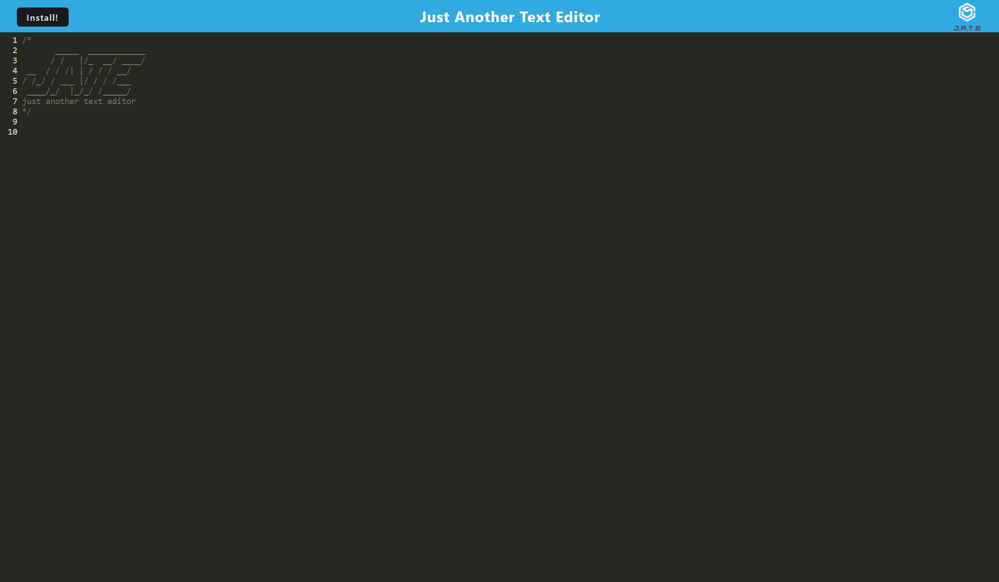

# Text Editor Starter Code

## Description

This application is a text editor/note taker that can be used to save snippets of code or write down notes to be accessed at a later date. This app is a single-page application that meets the PWA criteria, and can function offline with the use of service workers.

## Installation

### Staring the application through cloning

After cloning the repository, type the following into your terminal to download the root node modules.

 ''' npm i '''

 Next, run the following to download the node modules for the client and server.

 ''' npm run install '''

 Lastly, run the following to start the application in localhost3000.

 ''' npm run start '''

### Starting the application through Heroku

Click on the link below to be taken to the heroku deployment of this application.

https://floating-mesa-79815.herokuapp.com/

## Images

